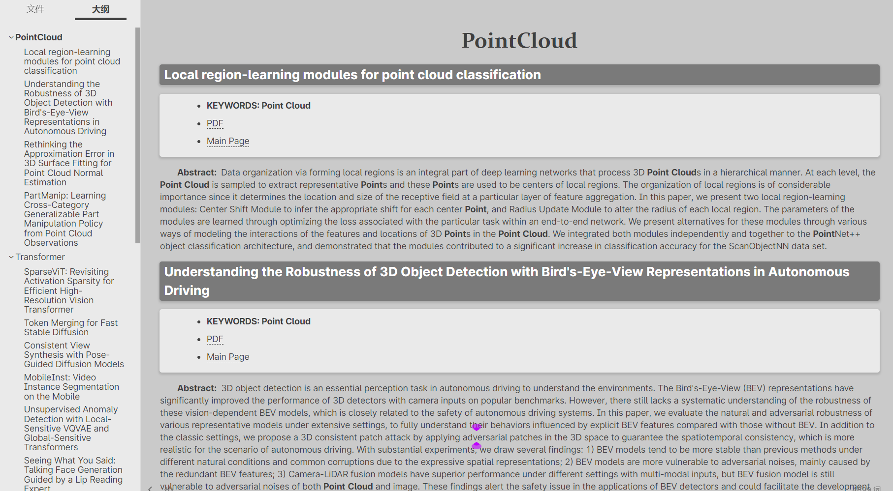

# Usage
**(1) Python enviroment**
```shell
conda create -n env_spider python=3.9
conda activate env_spider
pip install -r requirements.txt
```

**(2) run it**
```shell
python -m arxiv_spider
```

**(3) file explain**
- **data_all** store the json file of each day paper.
- **data_map** store the markdown that filter the keywords.
- **config.yaml** config your keywords.


# How to change config.yaml

You can change `kw_list`, in this example, it contain two kw_dict: "PCR" and "Transformer".
- [ ] **TODO**: explain ...  

```yaml
kw_list:
  "PCR": {
    "PointCloud": [
        ["PointCloud"], ["Point Cloud"], 
    ], 
    "PCR": [
        ["Registration"], 
        ["3D", "Descriptor"], 
        ["3D", "Detector"], 
        ["3D", "Detection"], 
        ["Local", "Feature"], 
        ["Match", "Matching"]
    ], 
    "Transformer": [
        ["Transformer"]
    ]
  }
  "Transformer": {
    "Transfomer": [
      ["Transformer"]
    ]
  }

# save path
arxiv_data_dir: "./data_all"
map_data_dir: "./data_map"
```

result
======

2023-03-31
----------



TODO
====

- [ ] 修改为能指定解析：某个在arxiv上高级检索结果的网页
